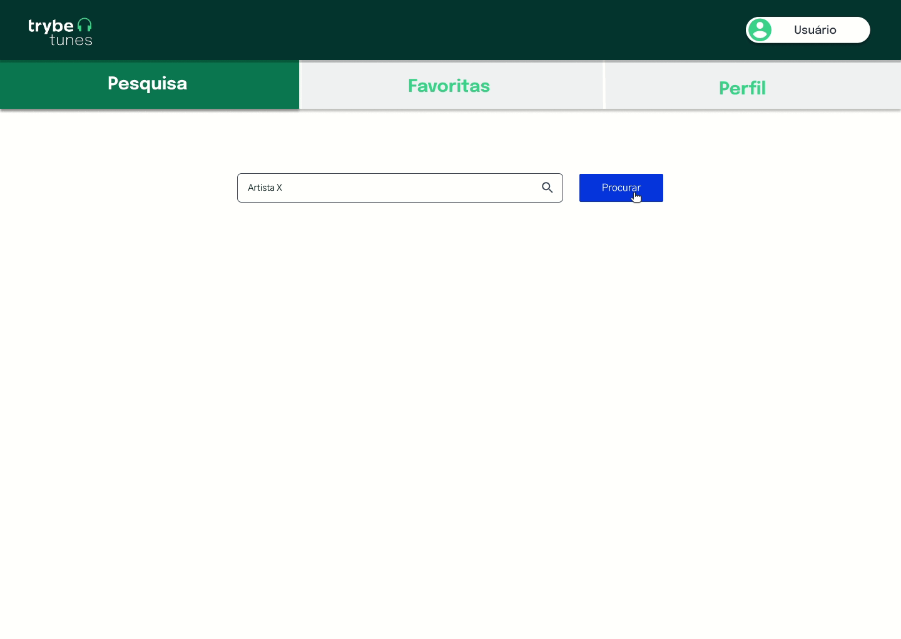
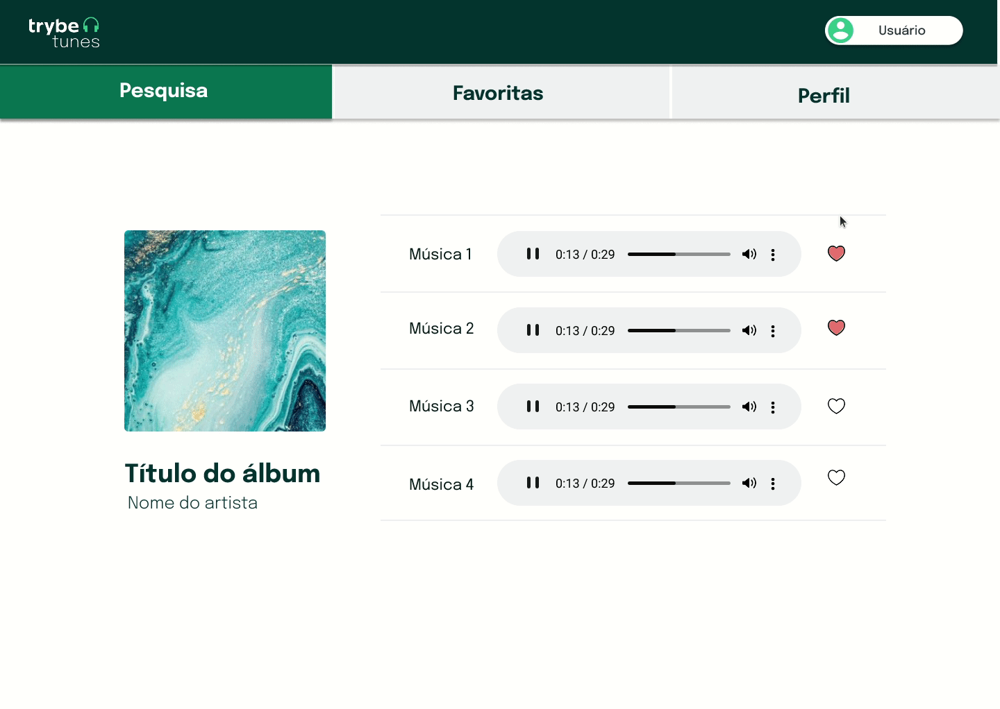

# TrybeTunes





> 
Neste projeto eu criei o TrybeTunes, uma aplicação capaz de reproduzir músicas, criar lista de músicas favoritas e editar o perfil da pessoa usuária.
Tudo isso usando uma API do ITunes

### O que esperar da aplicação:

- Tela de login;
- Pesquisar por uma banda ou artista;
- Listar os álbuns disponíveis dessa banda ou artista;
- Visualizar as músicas de um álbum selecionado;
- Reproduzir uma prévia das músicas deste álbum;
- Favoritar e desfavoritar músicas;
- Ver a lista de músicas favoritas;
- Ver o perfil da pessoa logada; ######<i>-- em desenvolvimento </i>
- Editar o perfil da pessoa logada; ######<i>-- em desenvolvimento </i>


### Ajustes e melhorias

O projeto ainda está em desenvolvimento e as próximas atualizações serão voltadas nas seguintes tarefas:

- [ ] Terminar a rota de perfil
- [ ] Terminar a rota de edição de perfil
- [ ] Melhorar a estrutura da aplicação
- [ ] produzir testes de integração
- [ ] Produzir testes unitários.

## 🚀 Instalando TrybeTunes

Para instalar o TrybeTunes, siga estas etapas:
(sistema operacional linux)

Abra seu terminal <ctrl> + <alt> + <t>
  
Clone o repositório:
```
git clone https://github.com/Bel-Albuquerque/TrybeTunes.git
```
Entre na pasta do repositório que você acabou de clonar:
 ```
cd TrybeTunes
  ```
Instale as dependências:
 ```
npm install
  ```
Para rodar a aplicação:
  ```
cd src/ && npm start
  ```
Agora é só acessar seu [localhost:3000](http://localhost:3000)
 
 
###### Projeto desenvolvido durante o curso da [Trybe](https://github.com/tryber).

 
